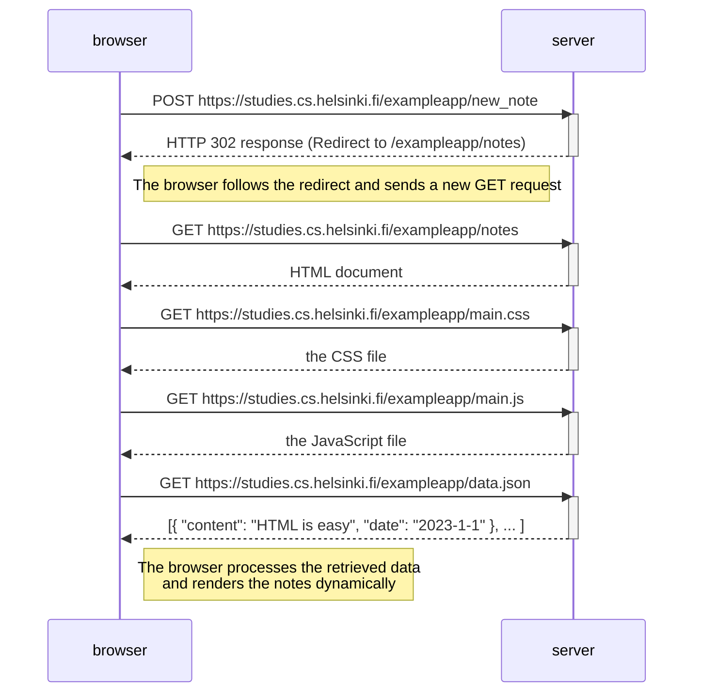

---

### **Explicación del flujo en el diagrama:**

1. **Envío del formulario**:
   - El navegador envía una solicitud `POST` al servidor con los datos del formulario.
   - El servidor responde con un código de estado `302` indicando una redirección.

2. **Redirección**:
   - El navegador sigue automáticamente la redirección y envía una solicitud `GET` a la URL proporcionada (`/exampleapp/notes`).

3. **Carga de recursos de la página**:
   - Se generan tres solicitudes adicionales para obtener los recursos necesarios: `main.css`, `main.js` y `data.json`.

4. **Procesamiento de los datos**:
   - El navegador utiliza los datos obtenidos (`data.json`) para renderizar dinámicamente las notas.

---
